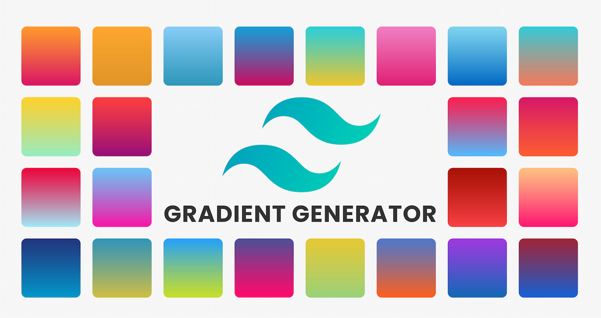

 
 
# Tailwind Gradient Generator

Link: [Tailwind Gradient Generator](https://tailwind-gradient-generator-master.vercel.app/)

<!-- ! -->
🌈 Tailwind Gradient Color Tool 🎨

Deskripsi Proyek:

Selamat datang di Tailwind Gradient Color Tool, sebuah pengalaman penuh warna untuk menciptakan gradasi menakjubkan dengan mudah menggunakan Tailwind CSS. Dikembangkan oleh Aidyl Syaputra, seorang siswa berumur 17 tahun yang tengah mengejar impian di Rekayasa Perangkat Lunak (RPL) di SMKN 1 Maros.

✨ Fitur Utama:

Pemilihan Mudah: Nikmati antarmuka yang intuitif untuk memilih kombinasi warna dengan cepat dan menyenangkan.
Kode Tailwind Otomatis: Hemat waktu dengan kode CSS Tailwind yang dihasilkan secara otomatis untuk integrasi langsung ke dalam proyek Anda.
Pratinjau Langsung: Lihat langsung bagaimana kombinasi warna yang dipilih merubah tampilan desain Anda.
🚀 Cara Menggunakan:

Pilih warna awal dan akhir dengan mudah menggunakan antarmuka yang stylish.
Salin kode Tailwind yang dibuat dan terapkan pada proyek Tailwind CSS Anda.
Saksikan desain Anda bersinar dengan gradasi warna yang menawan!
🤝 Cara Berkontribusi:
Kami mengundang Anda untuk berkontribusi dengan memberikan umpan balik, melaporkan bug, atau membuat perubahan melalui pull request. Kolaborasi Anda membantu memperkaya alat ini.

🎉 Tentang Pengembang:

Nama: Aidyl Syaputra
Usia: 17 tahun
Siswa di: SMKN 1 Maros, Jurusan Rekayasa Perangkat Lunak (RPL)
Terima kasih telah memilih Tailwind Gradient Color Tool! Semoga alat ini membawa keceriaan dalam pengembangan desain Anda dan membantu Anda menciptakan tampilan yang luar biasa dengan sentuhan warna yang unik.

🌟 Selamat berkreativitas! 🌈

### Thanks ❤️

Project strongly inspired in https://gradient-designer.csspost.com by @jenstornell
